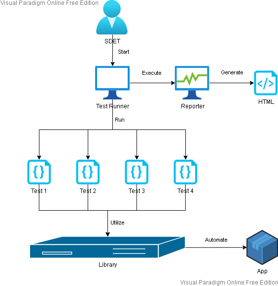

# mortgageCalculator-AutoIt

The desktop application under test is a mortgage calculator that can be found [here](https://www.mortgagecalculator.net/).

I have used the *Structured Scripting Framework*, which reduces code duplication, to automate five test cases with the help of the script editor [**SciTE4AutoIt3**](https://www.autoitscript.com/site/autoit-script-editor/) and the element inspector [**AutoIt v3 Window Information**](https://www.autoitscript.com/autoit3/docs/intro/au3spy.htm).

Since this is a refactored version of a project I did back in June 2020, here are the changes made:

- Changed the project structure by moving files to their respective folders
- Corrected and added some comments
- Renamed some variables for more meaningful names
- Deleted the `loanAmountInvalidTest.au3` file and moved the `InvalidLoanAmount()` function in the same file of the `ValidLoanAmount()` function since they are part of the same functionality
- Moved the `GenerateReport()` function into its own file
- Fixed minor HTML errors in the test report to make it **W3C standard** compliant
- Created the framework design diagram

## Contents

 - [Framework](#framework)
 - [How it works](#how-it-works)
   - [Features](#features)
 - [Installation](#installation)
   - [Prerequisites](#prerequisites)
   - [How to install](#how-to-install)
   - [How to run](#how-to-run)
 - [Contact](#contact)

## Framework

The following diagram shows the framework design:

<p align="center"></p>

The different components are as follow:

- Test Runner

  Runs test cases sequentially

- Test

  Implements one or more test cases
  
- Library

  Provides tests common functions to interact with the mortgage calculator application

- Reporter

  Generates the following HTML test report that displays passed and failed test cases in green and red respectively:
  
<p align="center"></p>

## How it works

Here's the Test Runner application graphical user interface (GUI) that I've built:

<p align="center"></p>

### Features

- Running a single test case by selecting it from the drop-down list
- Running the test suite
  - one time based on the order test cases appear in the dropdown
  - n times randomly because tests should be independent
- Automatic generation of the test report in HTML format

*Note: The test suite can't be executed in order more than once.*
*If the text input field is empty or has zero for value then this is the same as if 1 was entered.*
*Also, characters other than digits are not allowed.*

## Installation

### Prerequisites

- Mandatory
  - Any browser e.g., Chrome and Edge
- Optional
  - [AutoIt](https://www.autoitscript.com/site/)
  - Git Bash

*Note: AutoIt is only available for Microsoft Windows operating system from XP to 10.*
*For Linux and macOS, you can use a virtualization software running a compatible Win OS.*
*Another alternative would be to install [**Wine**](https://www.winehq.org/) to run `.exe` files.*

### How to install

Run the following command in Git Bash:

```bash
$ git clone https://github.com/mk-sdet/mortgageCalculator-AutoIt.git
```

or download and unzip the repository in a folder.

### How to run

#### Method 1:

Run this command in `cmd`/`terminal` inside the testRunner folder:

```bash
testRunner.exe
```

or execute `testRunner.exe` directly from the File Explorer.

#### Method 2:

Right-click on `testRunner.au3` and choose any of the Run Script options.

## Contact

Created by [Muana Kimba](https://www.linkedin.com/in/mkimba)
